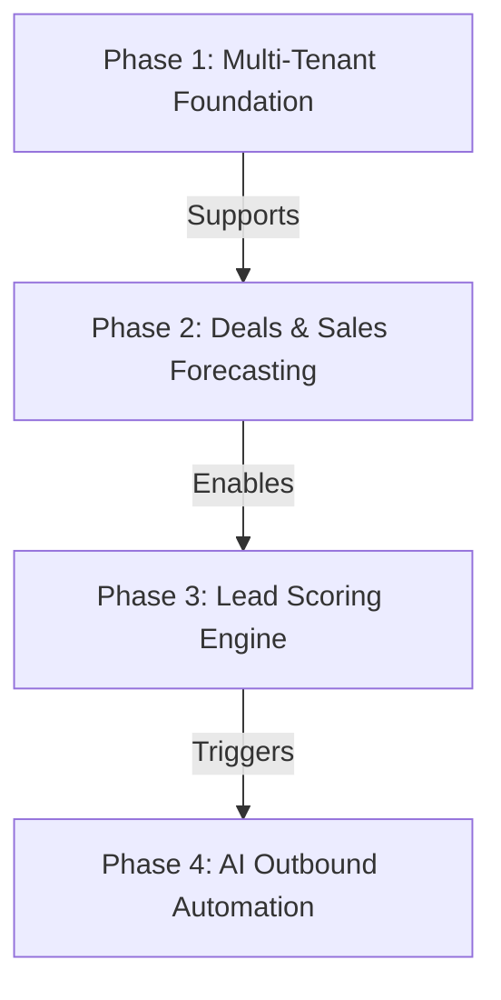

# Founding Engineer Proposal: Multi-Tenant Venture-Studio CRM (Growth Engine)

## 1. Executive Summary & Product Vision

In a Venture Studio setting, portfolio startups share a common struggle: they need a sophisticated growth pipeline (leads, accounts, deals, event tracking, and personalized outreach) but lack the engineering capacity to build one from scratch.

### The Problem with Commercial CRMs
Standard commercial CRM systems (such as HubSpot or Salesforce) are designed for single business entities. They lack native support for a unified "Studio View" and do not accommodate the shared-service model of a Venture Studio. Studios typically employ **common growth partners** (marketers, growth hackers, and sales leaders) who manage and deploy unified sales and outbound outreach strategies across the entire portfolio. 
Under conventional systems, studios are forced to manage separate, fragmented CRM instances for each startup, making it impossible to share templates, config structures, or run unified growth plays across portfolio companies without massive administrative overhead and high license costs.

### The Solution: Venture-Studio CRM
This proposal outlines the design for a **Multi-Tenant Venture-Studio CRM (Growth Engine)** that acts as a shared infrastructure service, providing flexibility to both the studio and its startups:
*   **For Startups (Tenants)**: They get completely isolated workspaces to manage their leads, deals, and event tracking, ensuring proprietary sales data never leaks across startups.
*   **For the Studio (Super Admins/Growth Partners)**: They gain a single roll-up dashboard to monitor performance across all startups and can distribute standardized templates, scoring rules, and outbound strategies across the entire portfolio in one click.

The central technical challenge is **strict multi-tenant isolation** on a shared database cluster for cost-efficiency. Our design solves this using **PostgreSQL Row-Level Security (RLS)** and transaction-level connection pool safety, allowing the studio to scale to 100+ startups securely.

---
## 2. Phased Implementation Roadmap

*(Note: If I had to implement this multi-tenant CRM, this would be the rough high-level planning. All detailed functional specifications, scenarios, and sequence diagrams for these stages are fully documented in the [Product Requirements Document (prd.md)](file:///Users/shagunarora/work-in-progress/meraki-labs-assignment/documentations/product/prd.md).)*

To deliver value quickly while minimizing architectural risk, I propose a 4-phase rollout plan. The implementation order is structured around dependencies:

### Phase 1: Multi-Tenant Foundation & Lead Capture (Weeks 1–2)
*   **Goal**: Establish the secure multi-tenant database layer, role-based session contexts, and basic CRM entities.
*   **Deliverables**:
    *   PostgreSQL schema with **Row-Level Security (RLS)** active on all tables.
    *   **Unified Session Context & View Handlers**:
        *   **Tenant View**: Enforces RLS filters where users only see records matching their specific `tenant_id` (startup workspace isolation).
        *   **Studio View**: Allows Venture Studio Admins and shared growth partners to access cross-tenant rollups and dynamically toggle/impersonate a specific startup's "Tenant View" to configure rules or review drafts.
    *   Tenant workspace onboarding and user provisioning endpoints.
    *   Basic lead capture webhook API (supporting integrations with web forms and landing pages).
    *   Standard CRM CRUD operations for Leads, Accounts, and Contacts.

### Phase 2: Deals & Sales Forecasting (Weeks 3–4)
*   **Goal**: Enable deal tracking, revenue forecasting, and portfolio-wide reporting for both startups and the studio.
*   **Deliverables**:
    *   **Custom Tenant Pipelines**: Allow startup tenants to define custom pipelines, stages, and associated win probabilities (e.g., Prospecting: 10%, Demo: 30%, Proposal: 70%).
    *   **Weighted Sales Forecasting Engine**: Provide tenants with forecasting computations that predict expected revenue based on deal values and stage probabilities.
    *   **Studio Roll-up Sales View**: Aggregates individual startup deal pipelines and forecasts into a unified, permission-secured dashboard for Venture Studio partners.
    *   **Pipeline Audit Logs**: Tracks stage transitions and close-date histories for accurate velocity metrics.

### Phase 3: Lead Scoring & Qualification Engine (Weeks 5–6) — *Implemented Slice*
*   **Goal**: Automate lead qualification so sales teams only focus on high-intent prospects.
*   **Deliverables**:
    *   **Fit Rule Evaluator**: Firmographic evaluation based on static lead properties (`industry`, `company_size`, `geography`, `title`).
    *   **Behavioral Scorer**: Batch evaluations of website/product engagement logs (mocked in V1, aggregating event frequencies over configurable lookback windows).
    *   **Stage State Machine**: Automated lifecycle promotions (`pre_mql` $\rightarrow$ `mql` $\rightarrow$ `sql`) based on tenant-specific score thresholds, protected by manual override safety flags.
    *   **Rule Contract Registry**: Version-controlled JSONB schemas preventing invalid rule configurations from entering the DB.

### Phase 4: AI-Assisted Outbound & Sequence Swaps (Weeks 7–8)
*   **Goal**: Engage leads automatically using personalized outreach templates and LLM draft generation.
*   **Deliverables**:
    *   Sequence scheduler enqueuing outreach steps for leads.
    *   **Dynamic Sequence Swapping**: Automatically halting active Pre-MQL template sequences and enrolling leads in personalized MQL draft sequences when their stage is promoted.
    *   **AI Draft Generator & Queue**: Non-blocking LLM worker generating personalized draft emails based on lead context, stored in a dashboard queue waiting for manual sales rep approval.

---

## 3. Comments on My Current Implementation

This section details my reflections on the delivered prototype slice, including what was purposefully deferred, how to transition to a production MVP in two weeks, and how the architecture scales.

### 3.1 Deliberately Deferred Capabilities (Scope Exclusions)
To hit my tight 2-day prototype constraint, I ruthlessly scoped out secondary features and deferred them to V2:
*   **Live PostHog Ingestion (V2)**: I mock-store event logs in a local PostgreSQL table instead of building active webhook event streams and token rotations from external PostHog accounts.
*   **GDPR & Opt-Out Workflow (V2)**: Leads are marked as `status = 'disqualified'` instead of building physical deletion logic or handling opt-out email tracking. This keeps the database model lean and maintains audit logs intact.
*   **Automated Outbound Workers (V2)**: The cron job scheduler and email sender tasks are stubbed. The current prototype focuses on the qualification trigger mechanics rather than SMTP/SendGrid delivery and worker thread handling.
*   **Performance Marketing Attribution (V2)**: Detailed campaign-source multi-touch attribution reports for both tenant and parent admins are deferred, keeping dashboard queries strictly focused on sales aggregates.
*   **Real-time Alerts (V2)**: Internal notifications (e.g., Slack alerts on deal updates or emails pending approval) are pushed to future milestones.

### 3.2 Two-Week Extension Plan (Engine Completion)
If granted two additional weeks of engineering effort, I would write the complete **Lead Scoring and Qualification Engine** feature. Rather than spreading efforts thin over UI features or outbound email tasks, this extension will deliver a highly robust, production-grade mathematical and logic engine:

1.  **Nested Queries in Rule & Scoring Engine**:
    *   Extend the rule evaluator to support complex nested logical structures (e.g., nested `AND` and `OR` boolean query groups).
2.  **PostHog Connection Layer**:
    *   Fully implement the connection interface and client modules for PostHog.
    *   Ensure the integration layer works seamlessly with both the live PostHog API and a robust mock data engine to facilitate staging and offline verification.
3.  **PostHog Event Preprocessing Layer**:
    *   Build a dedicated pipeline to parse and preprocess incoming event payloads. Because telemetry events captured by PostHog are generally low-level data points (such as raw DOM interactions, clicks, and page views) rather than straightforward high-level milestones (like "Demo Requested"), this layer is required to preprocess and translate raw events into structured inputs before they can be evaluated by the rule engine.

### 3.3 Scalability Beyond 100k Users
*(Note: For scaling the platform to 100k+ active users across multiple startup tenants, certain architectural components such as database connection pools, read-replica aggregations, background queue workers, and PostHog ClickHouse replications will need to evolve. These scaling revisits and detailed paths are fully documented in the [Systems Design Doc (SYSTEMS_DESIGN.md)](file:///Users/shagunarora/work-in-progress/meraki-labs-assignment/SYSTEMS_DESIGN.md) and the [Product Requirements Document (prd.md)](file:///Users/shagunarora/work-in-progress/meraki-labs-assignment/documentations/product/prd.md).)*

#### Scale Envelope Assumptions
*   Startups (Tenants): **100**
*   Deals per tenant: **100** (Total portfolio: **10,000**)
*   Leads per tenant: **500** (Total portfolio: **50,000**)
*   Active Outbound Enrollments: **5,000** concurrent steps

#### What Breaks & How We Scale It
*   **Real-Time Super Admin Dashboard**: At **50,000+ deals** across 100 startups, running direct real-time relational SQL aggregations over transactional tables on read replicas will exceed the 500ms response budget. We will implement a Redis TTL cache and introduce a background batch worker to pre-aggregate sales metrics nightly into a `StudioSalesDailyRollup` table.
*   **PostHog Event Telemetry Scale**: While PostHog allows query aggregation grouped by tenant (rather than making individual per-lead API calls), scaling to hundreds of tenants will eventually bottleneck on runtime processing. To prevent heavy runtime preprocessing and API latency as the tenant count grows, I will introduce query parallelization, store pre-built ClickHouse event aggregations locally, or replicate PostHog event streams to a local ClickHouse instance.
*   **Outbound Sequence Cron Schedulers**: Polling the database via a single database query to find leads due for their next follow-up step will bottleneck. We will migrate to a partitioned queue scheduler (e.g., Celery/Redis) partitioned by tenant ID ranges.
*   **PostgreSQL Connection Limits & RLS Session Safety**: In a multi-tenant environment, scaling database connection pools (via PgBouncer) introduces transaction safety risks. We will strictly enforce RLS session variables using `SET LOCAL` inside transactions so settings automatically discard when the transaction ends.
