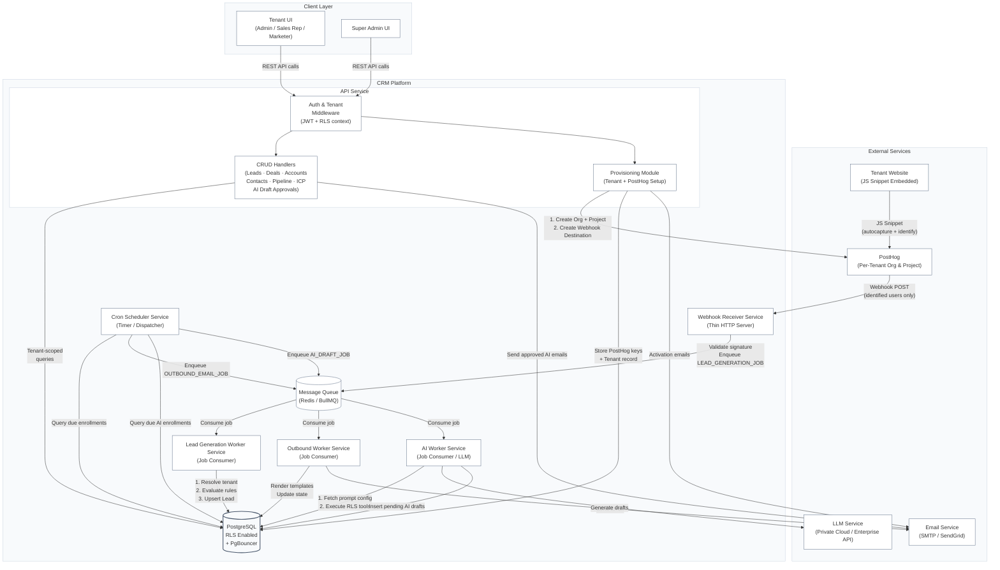

# System Architecture

This document contains the high-level container architecture diagram for the Venture-Studio CRM platform. This is a first draft based on the workflows defined so far. It will be refined after the data modelling step and additional workflows.

---

## Container Diagram (V1 Draft)

---

## Workflow Coverage

| Workflow | Services Involved |
|---|---|
| **1. Provisioning** (Super Admin creates tenant, Tenant Admin onboards) | API Service (Provisioning Module) → PostHog API + Email Service + DB |
| **2. Lead Management CRUD** (Tenant users manage leads) | API Service (CRUD Handlers) → DB |
| **3. Automated Lead Generation** (PostHog events → Lead records) | PostHog → Webhook Receiver Service → Queue → Lead Generation Worker Service → DB |
| **4. Deal Management** (Pipeline stages, deals, forecasting) | API Service (CRUD Handlers) → DB |
| **5. Pre-MQL Outbound Automation** (Scheduled email dispatch) | Cron Scheduler Service → DB → Queue → Outbound Worker Service → DB & Email Service |
| **6. MQL AI-Assisted Outbound Automation** (Scheduled draft generation & approval) | Cron Scheduler Service → DB → Queue → AI Worker Service (calling LLM) → DB; API Service (CRUD Handlers) → DB & Email Service |

---

## Key Design Decisions Reflected

- **API Service and Async Layer are separate deployable units.** They share domain logic but scale independently — API scales with user request rate, Workers scale with queue depth.
- **One shared Webhook Receiver endpoint** handles events from all tenants. Tenant is resolved inside each job using the PostHog `project_id` → `tenant_id` DB lookup.
- **PostHog is configured per-tenant** (separate Org + Project + Webhook Destination), ensuring native event isolation without shared-schema filtering tricks.
- **PostgreSQL RLS** enforces data isolation at the DB level as a safety net. See [decisions.md](file:///Users/shagunarora/work-in-progress/meraki-labs-assignment/documentations/decisions/decisions.md).
- **PgBouncer** sits in front of PostgreSQL to multiplex connections from multiple API and Worker instances at scale.
- **AI Tool Data Isolation & Security:** All LLM tools (function calls) executed by the AI Worker are constrained by PostgreSQL Row-Level Security (RLS) bound to the active tenant's context, preventing prompt hallucinations from cross-contaminating tenant boundaries.
- **LLM Data Privacy:** Decoupled architecture interfaces with a private cloud LLM or Enterprise API endpoint to guarantee zero utilization of tenant data for model training.
