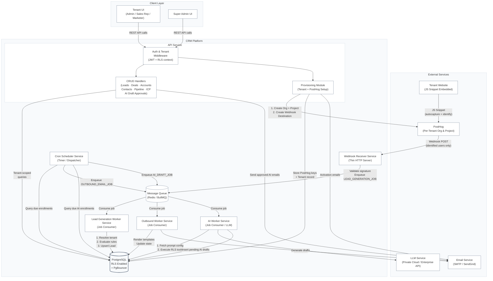

# System Architecture

This document contains the high-level container architecture diagram for the Venture-Studio CRM platform. This is a first draft based on the workflows defined so far. It will be refined after the data modelling step and additional workflows.

---

## Container Diagram (V1 Draft)

---

## Workflow Coverage

| Workflow | Services Involved |
|---|---|
| **1A. Studio Bootstrap** (Super Admin first-time setup, forced checklist, AI Base Instruction hard gate) | API Service (Provisioning Module) → DB |
| **1B. Tenant Provisioning & Member Onboarding** (SA creates workspace, TA activates & onboards, self-serve team invite) | API Service (Provisioning Module) → PostHog API + Email Service + DB |
| **2. Lead Management CRUD** (Tenant users manage leads) | API Service (CRUD Handlers) → DB |
| **3. Automated Lead Generation** (PostHog events → Lead records) | PostHog → Webhook Receiver Service → Queue → Lead Generation Worker Service → DB |
| **4. Deal Management** (Pipeline stages, deals, forecasting) | API Service (CRUD Handlers) → DB |
| **5A. Parent Workspace Dashboard & Tenant Switching** (SA views rolled-up metrics, switches tenant context via JWT) | API Service (CRUD Handlers) → Read Replica DB |
| **5B. AI Base Instruction Update** (SA updates studio-wide prompt, propagation to non-overriding tenants) | API Service (CRUD Handlers) → DB |
| **5C. Tenant AI Instruction Override & Revert** (Tenant Admin creates, edits, or deletes prompt override) | API Service (CRUD Handlers) → DB |
| **6. Pre-MQL Outbound Automation** (Scheduled email dispatch) | Cron Scheduler Service → DB → Queue → Outbound Worker Service → DB & Email Service |
| **7. MQL AI-Assisted Outbound Automation** (Scheduled draft generation & approval) | Cron Scheduler Service → DB → Queue → AI Worker Service (calling LLM) → DB; API Service (CRUD Handlers) → DB & Email Service |

---

## Key Design Decisions Reflected

- **API Service and Async Layer are separate deployable units.** They share domain logic but scale independently — API scales with user request rate, Workers scale with queue depth.
- **One shared Webhook Receiver endpoint** handles events from all tenants. Tenant is resolved inside each job using the PostHog `project_id` → `tenant_id` DB lookup.
- **PostHog is configured per-tenant** (separate Org + Project + Webhook Destination), ensuring native event isolation without shared-schema filtering tricks.
- **PostgreSQL RLS** enforces data isolation at the DB level as a safety net. See [decisions.md](file:///Users/shagunarora/work-in-progress/meraki-labs-assignment/documentations/decisions/decisions.md).
- **PgBouncer** sits in front of PostgreSQL to multiplex connections from multiple API and Worker instances at scale.
- **Studio Bootstrap hard-gates tenant creation.** The `AIPromptConfiguration` system-default row (`is_system_default = true`) must exist before any tenant workspace can be provisioned. This is enforced at the API layer and guaranteed by the forced onboarding checklist on first Super Admin login.
- **Dual-context JWT model for Super Admins.** A Super Admin's `identity_role` is fixed in the user record. The `active_workspace_context` (studio or a specific `tenant_id`) is updated in the JWT when the tenant switcher is used. This allows the API to enforce the correct permission set (read-only rollup vs. full tenant-admin CRUD) without altering the user's identity.
- **Parent Workspace dashboard queries are routed exclusively to the Read Replica** via the `app_studio_user` DB role, isolating portfolio-wide aggregation from the primary transactional workload. At V1 scale (~10K deals), on-the-fly SQL with the `idx_deals_rollup` composite index delivers results in 10–50ms with no caching layer needed.
- **AI Base Instruction uses a single-table fallback pattern.** One `AIPromptConfiguration` row with `is_system_default = true` holds the studio default. Tenant overrides are opt-in rows with `is_system_default = false`. The AI Worker resolves the active instruction at draft-generation time via an `ORDER BY is_system_default ASC LIMIT 1` query — tenant override wins if present, studio default is the fallback.
- **AI Tool Data Isolation & Security:** All LLM tools (function calls) executed by the AI Worker are constrained by PostgreSQL Row-Level Security (RLS) bound to the active tenant's context, preventing prompt hallucinations from cross-contaminating tenant boundaries.
- **LLM Data Privacy:** Decoupled architecture interfaces with a private cloud LLM or Enterprise API endpoint to guarantee zero utilization of tenant data for model training.
