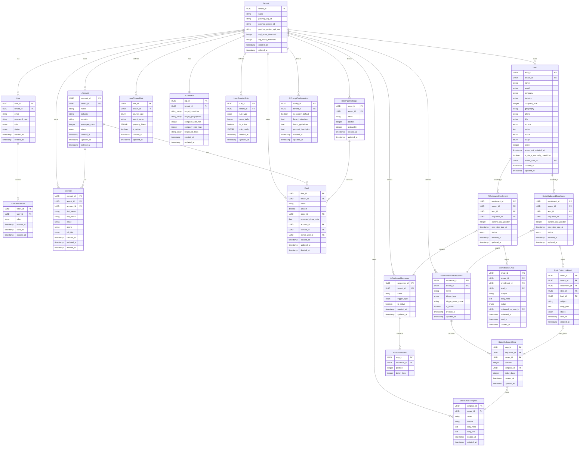

# Data Model

This document lists all core entities inferred from the workflows defined so far. Entities are grouped by service ownership. This is a first draft and will be refined after a dedicated data modelling session.

---

## Shared Entities (Cross-Service)

### Tenant
Represents a startup workspace under the venture studio.

| Field | Type | Notes |
|---|---|---|
| `tenant_id` | UUID | Primary key |
| `name` | string | Startup name |
| `posthog_org_id` | string | PostHog organization ID (created at provisioning) |
| `posthog_project_id` | string | PostHog project ID (created at provisioning) |
| `posthog_project_api_key` | string | PostHog JS snippet key (stored securely) |
| `mql_score_threshold` | integer | Default 50 |
| `sql_score_threshold` | integer | Default 80 |
| `created_at` | timestamp | |
| `deleted_at` | timestamp | Soft-delete |

---

### User
Represents any human actor in the system — Super Admin, Tenant Admin, or startup team member.

| Field | Type | Notes |
|---|---|---|
| `user_id` | UUID | Primary key |
| `tenant_id` | UUID | FK → Tenant. NULL for Super Admins |
| `email` | string | Unique per tenant |
| `password_hash` | string | Bcrypt hash |
| `role` | enum | `super_admin`, `tenant_admin`, `sales_rep`, `growth_marketer` |
| `status` | enum | `pending`, `active` |
| `created_at` | timestamp | |
| `deleted_at` | timestamp | Soft-delete |

---

### ActivationToken
Single-use tokens for account activation emails.

| Field | Type | Notes |
|---|---|---|
| `token_id` | UUID | Primary key |
| `user_id` | UUID | FK → User |
| `token` | string | Cryptographically secure random string |
| `expires_at` | timestamp | Configurable expiry window (e.g. 48h) |
| `used_at` | timestamp | Set on first use; NULL means unused |
| `created_at` | timestamp | |

---

### Account
A company/business entity being targeted or currently a customer.

| Field | Type | Notes |
|---|---|---|
| `account_id` | UUID | Primary key |
| `tenant_id` | UUID | FK → Tenant (RLS-enforced) |
| `name` | string | Company name |
| `industry` | string | |
| `website` | string | |
| `employee_count` | integer | |
| `status` | enum | `prospect`, `active_customer`, `churned` |
| `created_at` | timestamp | |
| `updated_at` | timestamp | |
| `deleted_at` | timestamp | Soft-delete |

---

### Contact
An individual person associated with an Account.

| Field | Type | Notes |
|---|---|---|
| `contact_id` | UUID | Primary key |
| `tenant_id` | UUID | FK → Tenant (RLS-enforced) |
| `account_id` | UUID | FK → Account |
| `first_name` | string | |
| `last_name` | string | |
| `email` | string | |
| `phone` | string | |
| `job_title` | string | |
| `created_at` | timestamp | |
| `updated_at` | timestamp | |
| `deleted_at` | timestamp | Soft-delete |

---

## Lead Service Entities

### Lead
A raw, unqualified prospect captured either manually or via automated events.

| Field | Type | Notes |
|---|---|---|
| `lead_id` | UUID | Primary key |
| `tenant_id` | UUID | FK → Tenant (RLS-enforced) |
| `name` | string | |
| `email` | string | Unique per tenant |
| `company` | string | |
| `industry` | string | Firmographic field |
| `company_size` | integer | Firmographic field |
| `geography` | string | Firmographic field |
| `phone` | string | |
| `title` | string | Job title |
| `source` | enum | `manual`, `posthog_website`, `linkedin_engagement` |
| `notes` | text | |
| `status` | enum | `active`, `disqualified`, `converted` (Operational state) |
| `stage` | enum | `pre_mql`, `mql`, `sql` (Lifecycle stage driven by score) |
| `score` | integer | Computed total (ceiling 100) |
| `score_last_updated_at` | timestamp | |
| `is_stage_manually_overridden`| boolean | Default false. If true, prevents cron downgrade. |
| `owner_user_id` | UUID | FK → User |
| `created_at` | timestamp | |
| `updated_at` | timestamp | |

> **Note:** Leads cannot be soft-deleted in V1. Use `status = disqualified` to freeze a lead. See [Decision 9](file:///Users/shagunarora/work-in-progress/meraki-labs-assignment/documentations/decisions/decisions.md#9-lead-records-are-not-deletable-in-v1).

---

### LeadTriggerRule
Tenant-configured rules that determine which inbound events should trigger automated lead creation. The worker loads rules matching the job's `source_type` to evaluate.

| Field | Type | Notes |
|---|---|---|
| `rule_id` | UUID | Primary key |
| `tenant_id` | UUID | FK → Tenant |
| `source_type` | enum | `posthog_website`, `linkedin_engagement`, `form_submission` (V2) |
| `event_name` | string | Event name to match (e.g. `pricing_page_viewed`) |
| `property_filters` | JSONB | Optional additional property conditions |
| `is_active` | boolean | Only active rules are evaluated |
| `created_at` | timestamp | |
| `updated_at` | timestamp | |

---

### ICPProfile
Ideal Customer Profile configured by the Tenant Admin during onboarding.

| Field | Type | Notes |
|---|---|---|
| `icp_id` | UUID | Primary key |
| `tenant_id` | UUID | FK → Tenant |
| `target_industries` | string[] | e.g. `["SaaS", "FinTech"]` |
| `target_geographies` | string[] | e.g. `["US", "EU"]` |
| `company_size_min` | integer | Minimum employee count |
| `company_size_max` | integer | Maximum employee count |
| `target_job_titles` | string[] | e.g. `["CTO", "VP Engineering"]` |
| `created_at` | timestamp | |
| `updated_at` | timestamp | |

---

### LeadScoringRule
Tenant-configured scoring dimensions for lead qualification. Fit rules evaluate lead attributes; Behavior rules evaluate aggregated PostHog events.

| Field | Type | Notes |
|---|---|---|
| `rule_id` | UUID | Primary key |
| `tenant_id` | UUID | FK → Tenant |
| `rule_type` | enum | `fit`, `behavior` |
| `score_delta` | integer | Points to add/subtract (e.g. 20, -10). Active sum <= 100. |
| `is_active` | boolean | Only active rules are evaluated |
| `rule_config` | JSONB | Schema depends on rule_type (e.g. fit operator vs event aggregate operator) |
| `created_at` | timestamp | |
| `updated_at` | timestamp | |

> **Note:** The JSONB `rule_config` avoids sparse tables. A database `CHECK` constraint ensures the JSON structure matches the `rule_type`. The API layer strictly validates attributes (e.g., `fit` fields must be `industry`, `company_size`, etc.).

---

## Deal Service Entities

### DealPipelineStage
A configurable stage within a tenant's deal pipeline. Stage probability is used for weighted sales forecasting.

| Field | Type | Notes |
|---|---|---|
| `stage_id` | UUID | Primary key |
| `tenant_id` | UUID | FK → Tenant |
| `name` | string | e.g. `Prospecting`, `Negotiation` |
| `position` | integer | Display order |
| `probability` | integer | 0–100 conversion probability (%) |
| `created_at` | timestamp | |
| `updated_at` | timestamp | |

---

### Deal
A sales opportunity linked to an Account and Contact.

| Field | Type | Notes |
|---|---|---|
| `deal_id` | UUID | Primary key |
| `tenant_id` | UUID | FK → Tenant (RLS-enforced) |
| `name` | string | Deal title |
| `amount` | decimal | Expected deal value |
| `stage_id` | UUID | FK → DealPipelineStage |
| `expected_close_date` | date | Used for forecasting |
| `account_id` | UUID | FK → Account |
| `contact_id` | UUID | FK → Contact |
| `owner_user_id` | UUID | FK → User |
| `created_at` | timestamp | |
| `updated_at` | timestamp | |
| `deleted_at` | timestamp | Soft-delete |

> **Indexes & Optimization:**
> * **Rollup Query Optimization B-tree Index:**
>   `CREATE INDEX idx_deals_rollup ON deals (created_at, stage_id, amount) WHERE deleted_at IS NULL;`
>   Used to optimize the parent workspace's rolled-up Sales pipeline calculations by performing Index-Only Scans.

---

## Outbound Service Entities (Static / Pre-MQL)

### StaticEmailTemplate
Reusable static email templates defined by the tenant. Supports merge tags for basic personalisation.

| Field | Type | Notes |
|---|---|---|
| `template_id` | UUID | Primary key |
| `tenant_id` | UUID | FK → Tenant |
| `name` | string | Internal label (e.g. "Intro Email") |
| `subject` | string | Email subject line (supports merge tags) |
| `body_html` | text | HTML body (supports merge tags e.g. `{{first_name}}`, `{{company}}`) |
| `body_text` | text | Plain-text fallback |
| `created_at` | timestamp | |
| `updated_at` | timestamp | |

---

### StaticOutboundSequence
A named, ordered pipeline of email steps bound to a specific trigger condition. A tenant can define multiple sequences for different trigger scenarios.

| Field | Type | Notes |
|---|---|---|
| `sequence_id` | UUID | Primary key |
| `tenant_id` | UUID | FK → Tenant |
| `name` | string | e.g. "New Lead Welcome Flow" |
| `trigger_type` | enum | `new_lead` \| `lead_event` |
| `trigger_event_name` | string | PostHog event name to match. Only applicable when `trigger_type = lead_event` |
| `is_active` | boolean | Only active sequences are evaluated at trigger time |
| `created_at` | timestamp | |
| `updated_at` | timestamp | |

---

### StaticOutboundStep
An individual step within a `StaticOutboundSequence`. Defines which template to send and how many days after the previous step.

| Field | Type | Notes |
|---|---|---|
| `step_id` | UUID | Primary key |
| `sequence_id` | UUID | FK → StaticOutboundSequence |
| `tenant_id` | UUID | FK → Tenant (RLS-enforced) |
| `position` | integer | Step order within the sequence (1-indexed). Unique per sequence |
| `template_id` | UUID | FK → StaticEmailTemplate |
| `delay_days` | integer | Days to wait after the previous step. `0` = send immediately |
| `created_at` | timestamp | |
| `updated_at` | timestamp | |

> **Unique Constraint:** `(sequence_id, position)` must be unique — no two steps in the same sequence can share the same position.


---

### StaticOutboundEnrollment
Tracks a specific lead's active or historical participation in a sequence. Acts as the **scheduler state store** — the cron job queries this table to determine what to execute and when.

| Field | Type | Notes |
|---|---|---|
| `enrollment_id` | UUID | Primary key |
| `tenant_id` | UUID | FK → Tenant |
| `lead_id` | UUID | FK → Lead |
| `sequence_id` | UUID | FK → StaticOutboundSequence |
| `current_step_position` | integer | The step that was last executed |
| `next_step_due_at` | timestamp | When the next step should be executed. NULL when sequence is complete or stopped |
| `status` | enum | `active` \| `completed` \| `paused_replied` \| `cancelled_stage_promoted` \| `cancelled_stage_demoted` |
| `enrolled_at` | timestamp | When enrollment was created |
| `updated_at` | timestamp | |

---

### StaticOutboundEmail
An append-only log of every individual email sent or attempted as part of a sequence step.

| Field | Type | Notes |
|---|---|---|
| `email_id` | UUID | Primary key |
| `tenant_id` | UUID | FK → Tenant |
| `enrollment_id` | UUID | FK → StaticOutboundEnrollment |
| `step_id` | UUID | FK → StaticOutboundStep |
| `lead_id` | UUID | FK → Lead |
| `subject` | string | Rendered subject (merge tags resolved) |
| `body_html` | text | Rendered HTML body (merge tags resolved) |
| `status` | enum | `queued` \| `sent` \| `failed` |
| `sent_at` | timestamp | Set when ESP confirms dispatch |
| `created_at` | timestamp | |

---

## AI Outbound Service Entities (MQL)

### AIPromptConfiguration
Stores the core LLM instructions. Tenants can override sections; missing fields fallback to the system default row.

| Field | Type | Notes |
|---|---|---|
| `config_id` | UUID | Primary key |
| `tenant_id` | UUID | FK → Tenant. NULL if `is_system_default` is true. |
| `is_system_default` | boolean | True for the global/studio-level fallback config. |
| `base_instructions` | text | Main instruction providing baseline AI context. |
| `brand_guidelines` | text | Defines tone (e.g. "Professional but friendly"). |
| `product_description` | text | Context on what the company sells. |
| `created_at` | timestamp | |
| `updated_at` | timestamp | |

> **Constraints & Lifecycle:**
> * **Unique constraints:**
>   * A partial unique index must enforce that only one global default configuration exists: `CREATE UNIQUE INDEX idx_only_one_system_default ON ai_prompt_configurations (is_system_default) WHERE is_system_default = true;`
>   * A unique index must enforce that a tenant has at most one custom configuration override: `CREATE UNIQUE INDEX idx_tenant_config_uniqueness ON ai_prompt_configurations (tenant_id) WHERE tenant_id IS NOT NULL;`
> * **Provisioning:**
>   * The global default row (`is_system_default = true`, `tenant_id = NULL`) is created by the first Super Admin during the **Studio Bootstrap** phase. Platform configuration prevents creating any tenant workspace until this record is inserted.

---

### AIOutboundSequence
Defines the trigger conditions for an AI-assisted sequence.

| Field | Type | Notes |
|---|---|---|
| `sequence_id` | UUID | Primary key |
| `tenant_id` | UUID | FK → Tenant |
| `name` | string | e.g. "MQL High Intent Flow" |
| `trigger_type` | enum | `mql_promoted` |
| `is_active` | boolean | |
| `created_at` | timestamp | |
| `updated_at` | timestamp | |

---

### AIOutboundStep
An individual scheduling step within an `AIOutboundSequence`.

| Field | Type | Notes |
|---|---|---|
| `step_id` | UUID | Primary key |
| `sequence_id` | UUID | FK → AIOutboundSequence |
| `position` | integer | Step order within the sequence (1-indexed) |
| `delay_days` | integer | Days to wait after the previous step |

---

### AIOutboundEnrollment
Tracks execution of an AI sequence.

| Field | Type | Notes |
|---|---|---|
| `enrollment_id` | UUID | Primary key |
| `tenant_id` | UUID | FK → Tenant |
| `lead_id` | UUID | FK → Lead |
| `sequence_id` | UUID | FK → AIOutboundSequence |
| `current_step_position` | integer | The position of the last executed step |
| `next_step_due_at` | timestamp | When the next draft should be generated |
| `status` | enum | `active` \| `completed` \| `paused_replied` \| `cancelled_stage_demoted` \| `cancelled_stage_promoted` |
| `enrolled_at` | timestamp | |
| `updated_at` | timestamp | |

---

### AIOutboundEmail
A unified state machine table for AI generated emails, tracking from draft queue to sent status.

| Field | Type | Notes |
|---|---|---|
| `email_id` | UUID | Primary key |
| `tenant_id` | UUID | FK → Tenant |
| `enrollment_id` | UUID | FK → AIOutboundEnrollment |
| `lead_id` | UUID | FK → Lead |
| `subject` | string | LLM generated subject |
| `body_html` | text | LLM generated HTML body |
| `status` | enum | `pending_approval` \| `approved` \| `rejected` \| `sent` \| `failed` |
| `reviewed_by_user_id` | UUID | FK → User (the rep who approved/rejected) |
| `reviewed_at` | timestamp | |
| `sent_at` | timestamp | |
| `created_at` | timestamp | |


---

## Entity Relationship Diagram



---

## Relationships Summary


```
Tenant 1──* User
Tenant 1──1 ICPProfile
Tenant 1──* LeadTriggerRule
Tenant 1──* LeadScoringRule
Tenant 1──* Lead
Tenant 1──* Account
Tenant 1──* Contact
Tenant 1──* DealPipelineStage
Tenant 1──* Deal
Account 1──* Contact
Account 1──* Deal
DealPipelineStage 1──* Deal
User 1──* ActivationToken
Tenant 1──* StaticEmailTemplate
Tenant 1──* StaticOutboundSequence
StaticOutboundSequence 1──* StaticOutboundStep
StaticOutboundStep *──1 StaticEmailTemplate
Lead 1──* StaticOutboundEnrollment
StaticOutboundEnrollment *──1 StaticOutboundSequence
StaticOutboundEnrollment 1──* StaticOutboundEmail
StaticOutboundEmail *──1 StaticOutboundStep

Tenant 1──* AIPromptConfiguration
Tenant 1──* AIOutboundSequence
AIOutboundSequence 1──* AIOutboundStep
Lead 1──* AIOutboundEnrollment
AIOutboundEnrollment *──1 AIOutboundSequence
AIOutboundEnrollment 1──* AIOutboundEmail
```

> **Note:** All tenant-scoped tables include `tenant_id` and are protected by PostgreSQL Row-Level Security (RLS). See [decisions.md](file:///Users/shagunarora/work-in-progress/meraki-labs-assignment/documentations/decisions/decisions.md#2-multi-tenancy-isolation-strategy) for the isolation strategy.
