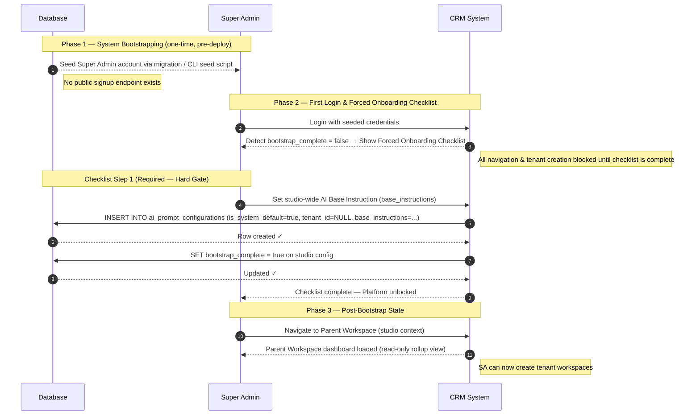
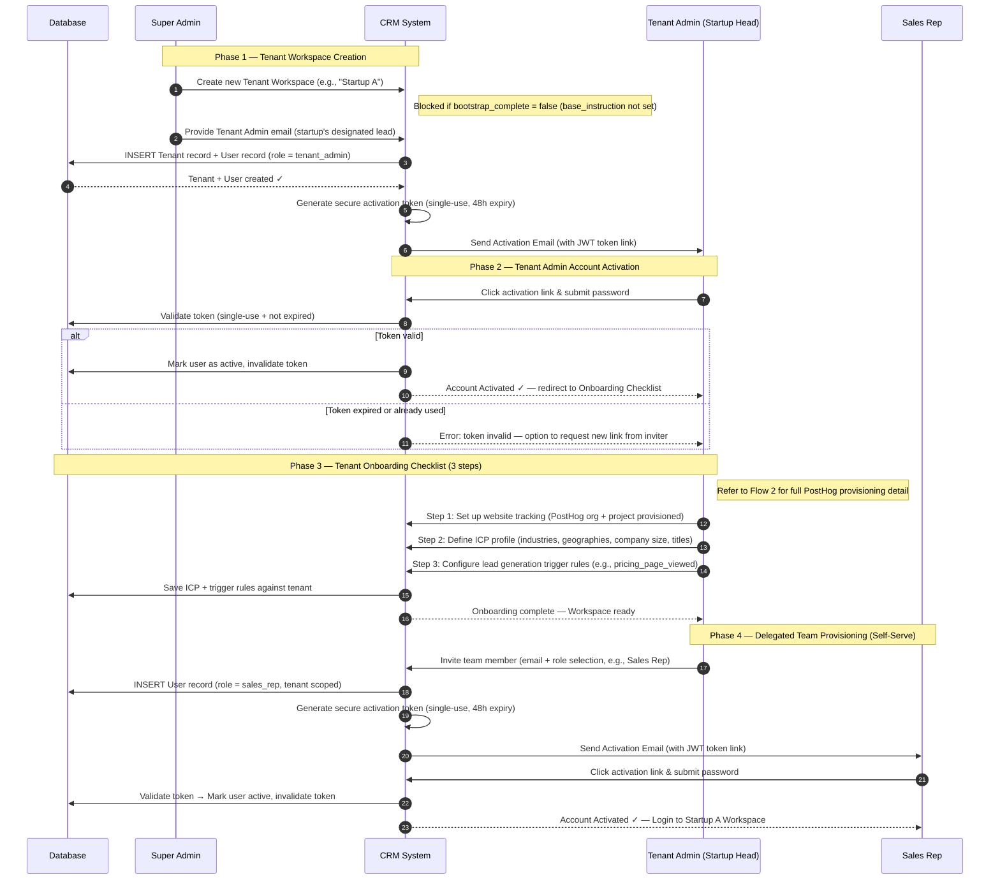
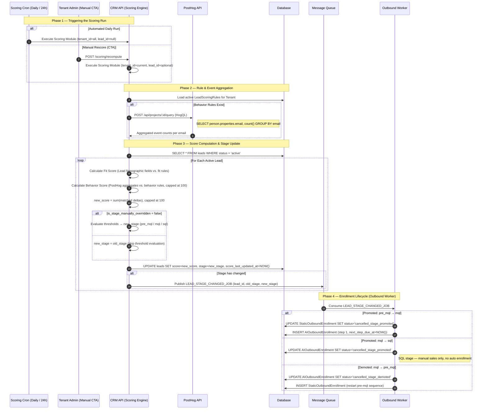
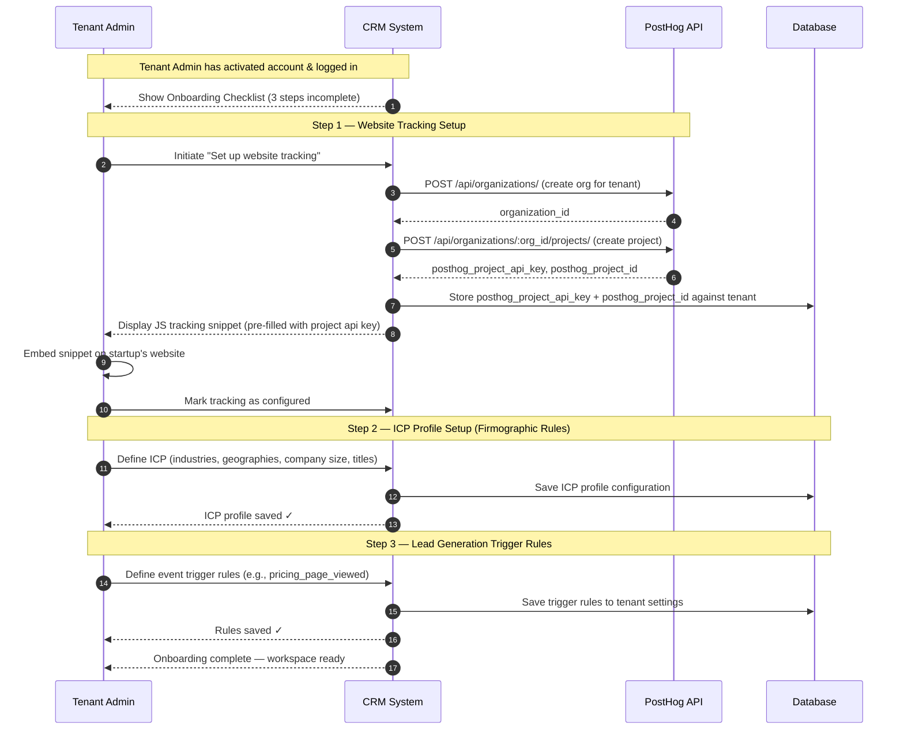
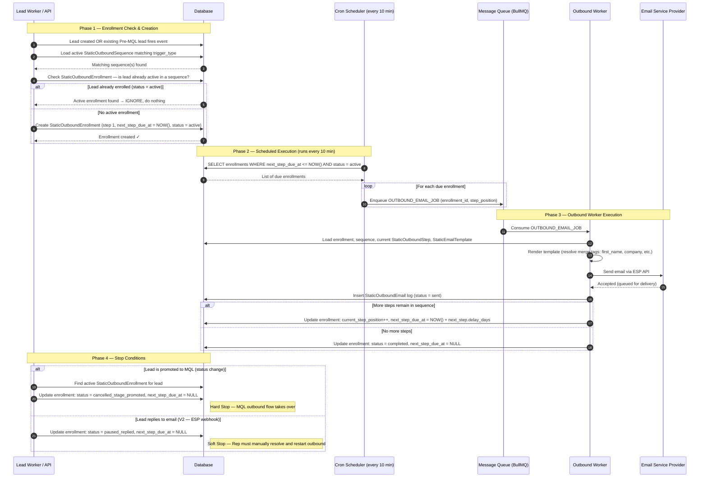
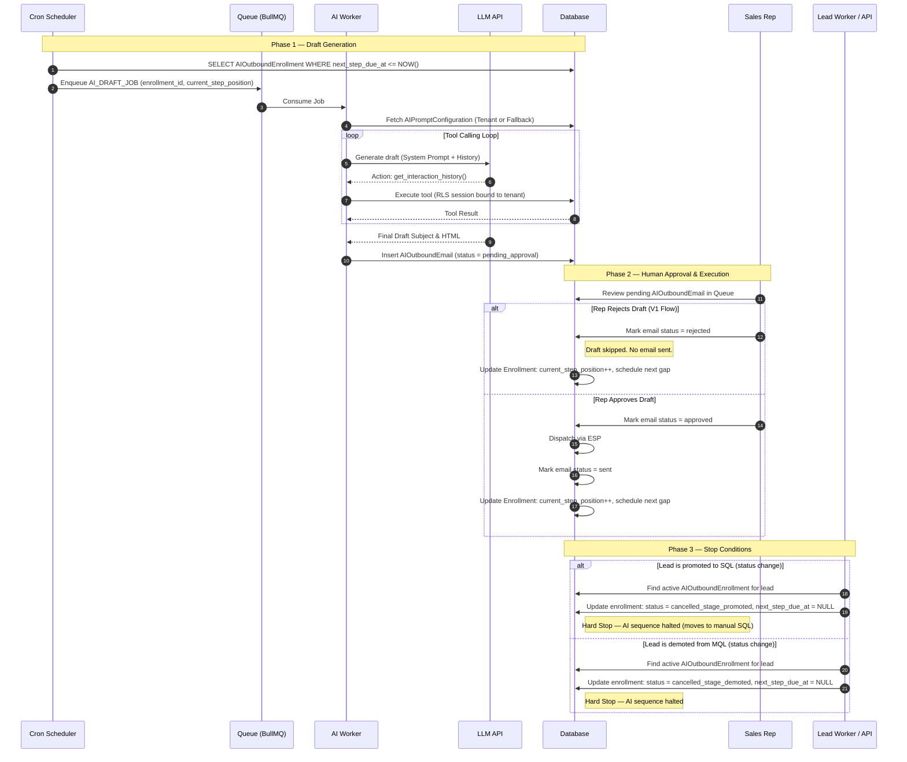
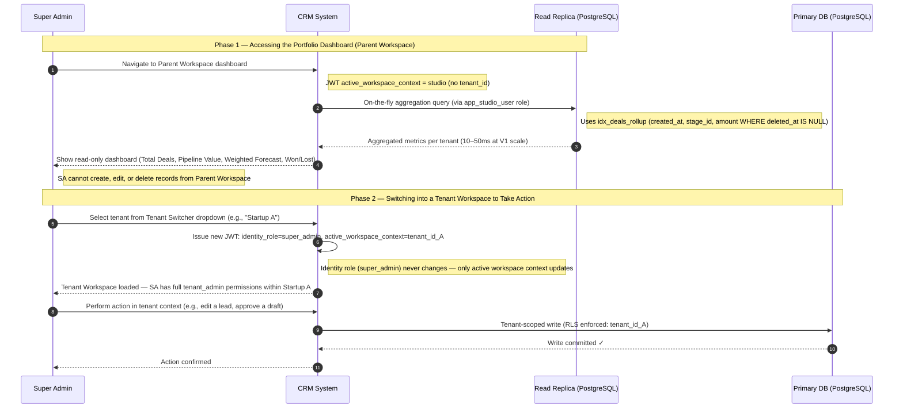
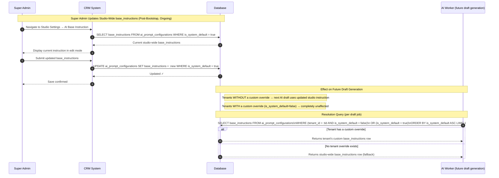
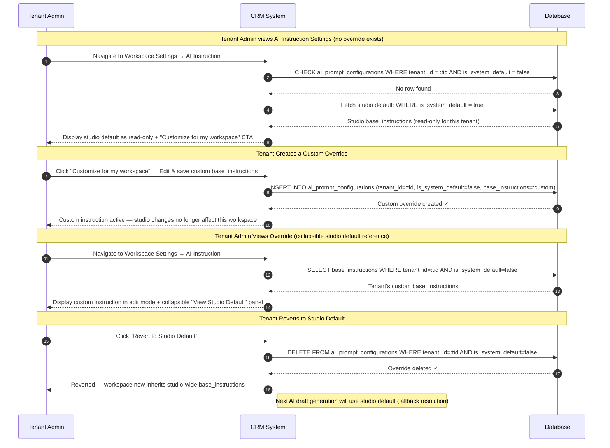

# CRM System Sequence & Flow Diagrams

This document contains scenario-based sequence and flow diagrams illustrating various operational processes and interactions within the Venture-Studio CRM.

## User & Tenant Provisioning Flows

### 1A. Studio Bootstrap (Super Admin First-Time Setup)

This flow covers the **one-time** platform initialisation performed before any tenant can be provisioned. The Super Admin account is seeded via a DB migration/CLI script (no public signup). On first login, a mandatory checklist hard-gates all further access until the studio-wide AI Base Instruction is set.

---

### 1B. Tenant Provisioning & Member Onboarding

This flow is **repeated for each new startup** added to the portfolio. It begins with the Super Admin creating a tenant workspace (only possible once Studio Bootstrap is complete) and ends with the startup's own team being fully onboarded in a self-serve manner.

---

## Lead Scoring & Lifecycle Flows

### 2. Lead Scoring & Qualification Pipeline

This flow covers the batch scoring process (triggered by cron or manual CTA), the HogQL aggregation of behavioral events, the evaluation of qualification thresholds, and the resulting stage transitions which emit events to halt or start outbound sequences.

---

### 3. Tenant Initial Setup & Onboarding Flow

This flow illustrates the post-login setup checklist completed by the Tenant Admin to establish tracking, configure the target client profile (ICP), and define the inbound triggers for automated lead generation.

---

## Outbound Automation Flows

### 4. Pre-MQL Outbound Execution Flow

This flow covers the runtime execution path for Pre-MQL outbound sequences: from a trigger event (new lead created or existing lead fires an event) through enrollment, scheduled execution via cron, and the stop conditions that cancel an active sequence.

> **Note:** Sequence and template *configuration* by the Tenant Admin is standard CRUD (not diagrammed here). This diagram focuses on the automated runtime path.

---

### 5. MQL AI-Assisted Outbound Execution Flow

This flow covers the generative loop and approval lifecycle for AI outbounds, operating off the array-based schedule.

---

## Super Admin Parent Workspace Flows

### 6. Super Admin Parent Workspace Operations

This flow covers the three ongoing operational interactions available to Super Admins within the Parent Workspace (studio context): viewing the rolled-up portfolio dashboard, switching into a tenant workspace to take action, and managing the studio-wide AI Base Instruction (including its propagation and tenant override lifecycle).

#### 5A. Rolled-Up Sales Dashboard & Tenant Context Switching

---

#### 5B. AI Base Instruction Management (Super Admin Update Flow)

---

#### 5C. Tenant AI Base Instruction Override & Revert Lifecycle

