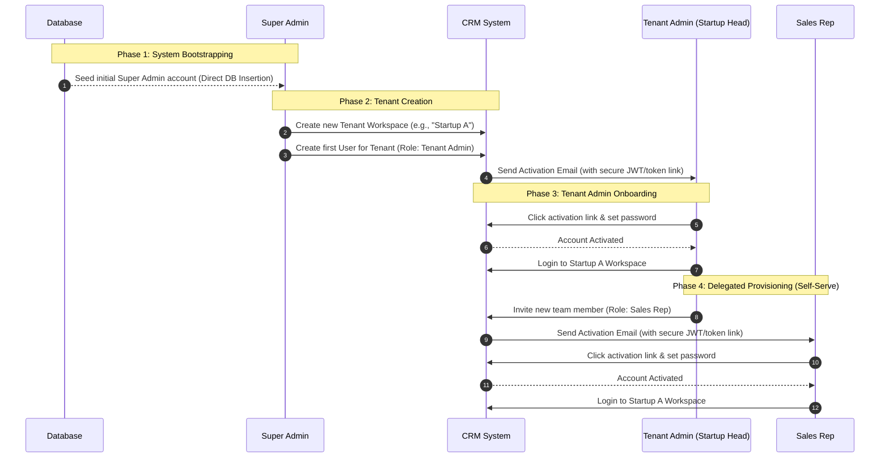
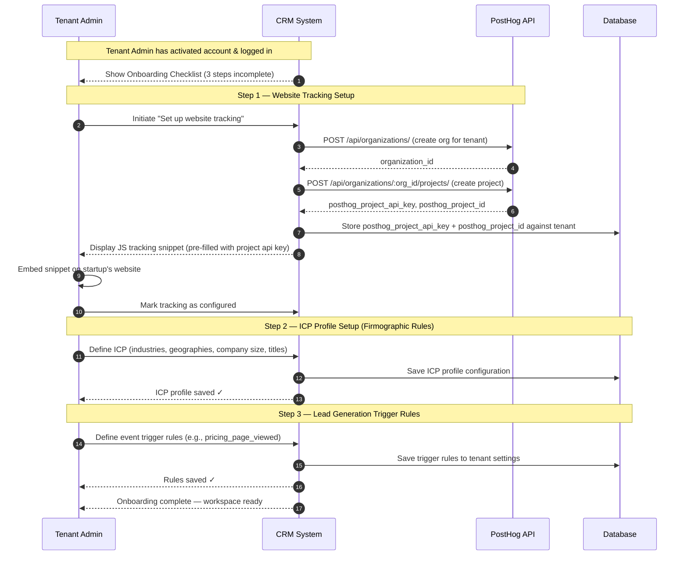
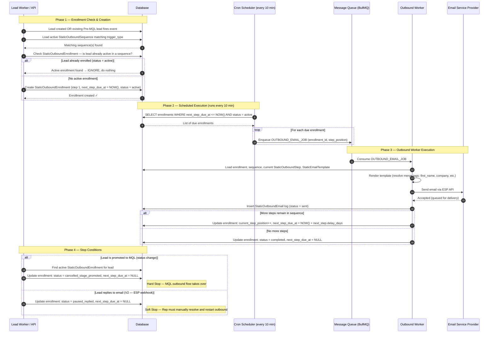
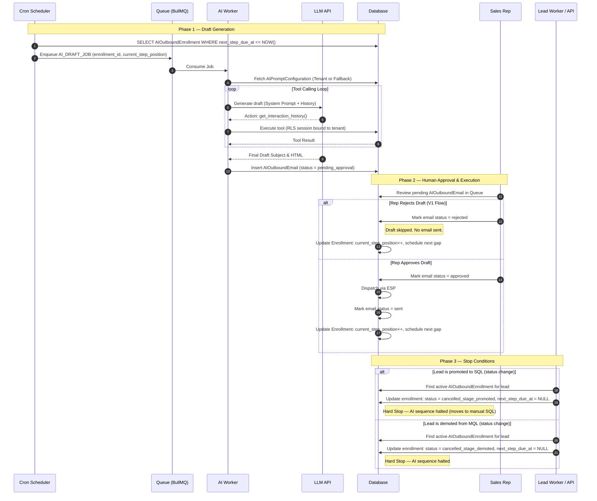

# CRM System Sequence & Flow Diagrams

This document contains scenario-based sequence and flow diagrams illustrating various operational processes and interactions within the Venture-Studio CRM.

## User & Tenant Provisioning Flows

### 1. Initial Tenant Registration & Delegation Flow

This flow demonstrates how the system is bootstrapped, how the Super Admin creates a new startup tenant, and how user management is securely delegated to the startup's own admin.

---

### 2. Tenant Initial Setup & Onboarding Flow

This flow illustrates the post-login setup checklist completed by the Tenant Admin to establish tracking, configure the target client profile (ICP), and define the inbound triggers for automated lead generation.

---

## Outbound Automation Flows

### 3. Pre-MQL Outbound Execution Flow

This flow covers the runtime execution path for Pre-MQL outbound sequences: from a trigger event (new lead created or existing lead fires an event) through enrollment, scheduled execution via cron, and the stop conditions that cancel an active sequence.

> **Note:** Sequence and template *configuration* by the Tenant Admin is standard CRUD (not diagrammed here). This diagram focuses on the automated runtime path.

---

### 4. MQL AI-Assisted Outbound Execution Flow

This flow covers the generative loop and approval lifecycle for AI outbounds, operating off the array-based schedule.

