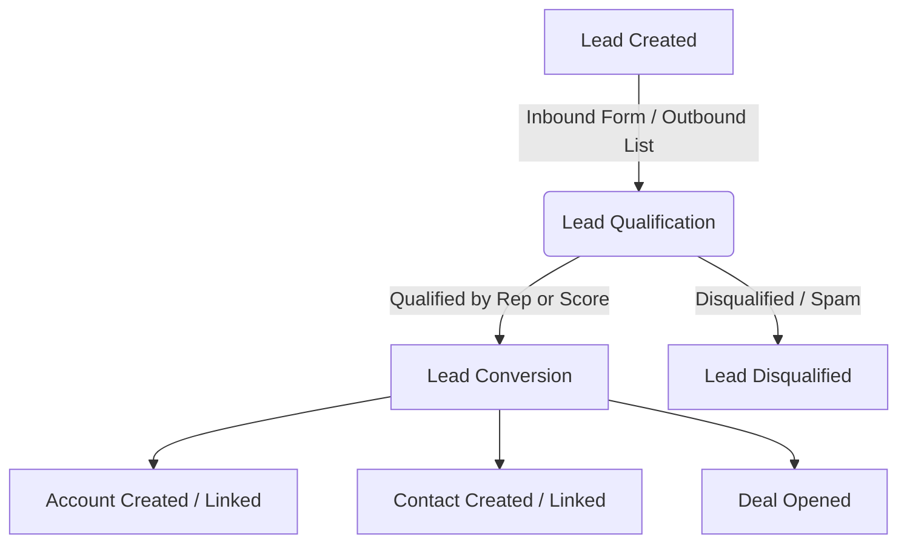

# CRM Domain Concepts

This document outlines the core business domain concepts, terminologies, and workflows used throughout this B2B Venture-Studio CRM. Refer to this to understand the underlying business entities, status meanings, and sales conversion processes.

---

## 1. Core Domain Concepts

### Customer Relationship Management (CRM)
A CRM is a system that manages all of a company's relationships and interactions with customers and potential customers. It helps teams track engagement, streamline processes, and improve profitability throughout the marketing and sales lifecycle.

### Tenant (Startup Workspace)
In a multi-tenant CRM, a tenant represents an individual startup or business unit under the parent Venture Studio. Each tenant has their own isolated workspace, team members, customers, data, and configurations. Startups operate in complete isolation from one another.

---

## 2. Core Entities

### Lead
*   **Definition:** A raw, unqualified prospect. It represents an individual or company that has shown initial interest (e.g., filled out a website form, downloaded a resource) or fits the target profile, but has not yet been vetted or qualified by a sales representative.
*   **Decoupled Lifecycle:** A lead's business lifecycle is tracked using two distinct properties: their operational status (whether they are active or archived) and their lifecycle stage (how engaged they are).

### Account
*   **Definition:** A business entity, company, or organization that the startup does business with or is actively trying to sell to (e.g., *Stripe*, *Acme Corp*).
*   **Relationships:** An Account is the parent organization for one or more **Contacts** (employees of that company) and is associated with one or more **Deals** (sales cycles).

### Contact
*   **Definition:** An individual person associated with an Account (e.g., a Decision Maker or Product Manager at the target company).
*   **Role:** Contacts represent the human touchpoints for all communications, meetings, and marketing activities.

### Deal
*   **Definition:** A sales opportunity representing a potential transaction with an Account. Deals represent the active sales pipeline and are used to forecast revenue.
*   **Pipeline Stages:** Deals progress through a sequence of stages (e.g., *Prospecting*, *Demo*, *Negotiation*, *Closed Won*, *Closed Lost*), each representing a step closer to closing the sale.

---

## 3. Lead Operational Status vs. Lifecycle Stage

To maintain business clarity (e.g., avoiding situations where an active marketing lead is confused with one that has already opted out), the system distinguishes between a lead's operational availability and their marketing progression.

### 3.1 Operational Status
Operational status defines whether a lead is actively being worked or has exited the active funnel.
*   **Active:** The lead is in the funnel. They are actively engaged, scored, and eligible for automated or manual outreach.
*   **Disqualified:** The lead is spam, has opted out, or does not meet the minimum fit. They are frozen and excluded from active sales lists.
*   **Converted:** The lead has successfully progressed out of the lead phase and has been converted into an Account, Contact, and Deal.

### 3.2 Lifecycle Stage
Lifecycle stage defines the lead's position in the marketing and sales qualification funnel.
*   **Pre-MQL (Pre-Marketing Qualified Lead):** A raw lead with low or initial engagement. They typically receive standard, automated onboarding or nurturing materials.
*   **MQL (Marketing Qualified Lead):** A lead who has demonstrated sufficient engagement and fits the target profile. They are qualified for personalized, high-value outreach.
*   **SQL (Sales Qualified Lead):** A high-value lead that has shown direct, strong purchase intent (e.g., requesting a demo). They are handed off to sales representatives for direct, manual relationship building.

---

## 4. The B2B Lead Conversion Lifecycle

The progression of a prospect through the CRM follows this standard B2B conversion pipeline:

1.  **Lead Capture:** A lead enters the CRM (captured from website events, forms, or manual entry).
2.  **Scoring & Qualification:** The lead is monitored as they interact with the product or website. They progress from Pre-MQL to MQL based on fit and behavior.
3.  **Conversion:** When a sales representative determines the lead is ready to buy (SQL), they execute a **Lead Conversion**. The raw lead record is finalized, and three interconnected records are created to manage the relationship going forward:
    *   An **Account** representing the company.
    *   A **Contact** representing the individual person.
    *   A **Deal** representing the active sales opportunity.
