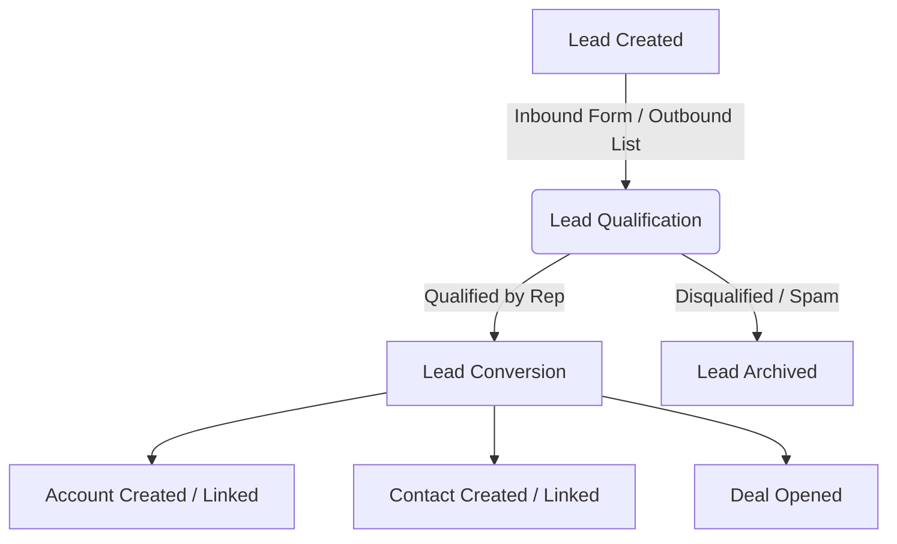

# CRM Domain Concepts

This document outlines the core business domain concepts and terminology used throughout this B2B Venture-Studio CRM. Refer to this to understand the data models and lifecycle flows.

---

## 1. Core Entities

### Lead
*   **Definition:** A raw, unqualified prospect. It represents an individual or company that has shown initial interest (e.g., filled out a form, downloaded a resource) or fits our target profile, but has not yet been vetted by a sales representative.
*   **State:** A Lead is temporary. It is either **Qualified** (converted to a Contact, Account, and Deal) or **Disqualified** (archived).
*   **Attributes:** Usually basic and unverified, such as name, email, phone, company name, and lead source.

### Account
*   **Definition:** A business entity, organization, or company that we either do business with or are actively trying to sell to (e.g., *Stripe*, *Acme Corp*).
*   **Relationships:** 
    *   An Account is the parent entity for one or more **Contacts** (employees of that company).
    *   An Account can have one or more **Deals** (sales cycles) over its lifetime.
*   **Attributes:** Company name, industry, website, size, billing/shipping address, and account status (e.g., *Prospect*, *Active Customer*, *Partner*, *Churned*).

### Contact
*   **Definition:** An individual person (e.g., *John Doe*). In a B2B context, this person is associated with a specific **Account** (company).
*   **Role:** Contacts represent the human touchpoints. They are the ones we email, call, and hold meetings with.
*   **Attributes:** First name, last name, job title, email, phone, and communication preferences.

---

## 2. The B2B Lead Conversion Lifecycle

The progression of a prospect through the CRM follows this standard pipeline:

1.  **Lead Capture:** A lead is created (manually or via automated integration).
2.  **Qualification:** Sales reps engage with the lead to verify interest, budget, authority, and needs.
3.  **Conversion:** Upon qualification, the Lead record is converted. The system:
    *   Creates or matches the **Account** (the company).
    *   Creates or matches the **Contact** (the person).
    *   Optionally creates a new **Deal** to track the sales cycle.
